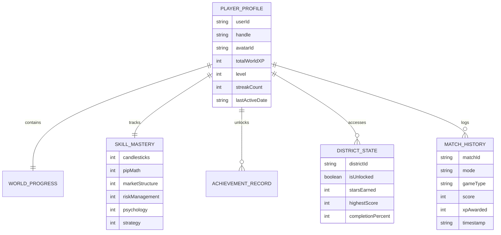
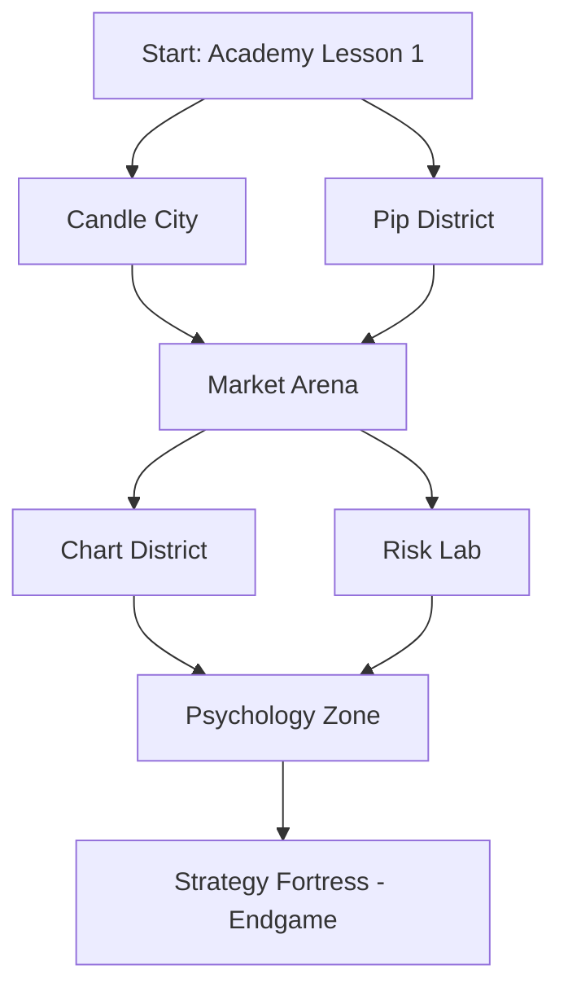

# STRATIVO WORLD — ARCHITECTURE & FOUNDATION SPECIFICATION
**Version:** 1.0 — Architecture & System Design
**Classification:** New Feature Area (Non-Destructive Extension)
**Status:** Audit Completed & Architecture Defined

---

## EXECUTIVE SUMMARY

**Strativo World** is a gamified, interactive learning metaverse engineered as a parallel gameplay ecosystem for Strativo Academy. It transforms abstract Forex concepts (candlestick reading, pip calculations, market structure, risk control, trading psychology, and strategy formulation) into engaging **Solo challenges** and **Multiplayer arenas**.

### Core Tenet
Strativo World does **not** replace the structured Academy. Instead, it forms a **bi-directional symbiosis**:
- **Academy Lessons & Quizzes** unlock districts, grant baseline XP, and impart theoretical knowledge.
- **Strativo World Games & Arenas** stress-test skills under simulated market pressure, award bonus XP/mastery, and feed back into the student's unified trading profile.

---

## 1. AUDIT OF EXISTING REUSABLE SYSTEMS

A comprehensive audit was performed across the codebase (`js/`, `css/`, `components/`, `data/`, `settings/`, `dashboard/`, `tools/`, `quizzes/`). The table below outlines what is functional, what is partial, and what is currently a placeholder.

```
┌──────────────────────────────────────────────────────────────────────────────────┐
│                         STRATIVO ACADEMY AUDIT MATRIX                            │
├──────────────────────────┬──────────────┬────────────────────────────────────────┤
│ System / Component       │ State        │ Reusability for Strativo World         │
├──────────────────────────┼──────────────┼────────────────────────────────────────┤
│ Progress Engine          │ Functional   │ Direct bridge for lesson unlock gates  │
│ Quiz Engine              │ Functional   │ Reusable question banks & score bridge │
│ Achievement Engine v1.0  │ Functional   │ Foundation for XP, streak & badges     │
│ Gamification Settings    │ Functional   │ UI toggle preferences (XP, social, etc)│
│ Component Loader v1.1    │ Functional   │ Dynamic header/navbar/footer injection │
│ UI Kit & CSS Tokens      │ Functional   │ Design tokens, cards, badges & buttons │
│ Module Labs (Pip/Risk)   │ Functional   │ Core simulation algorithms for games   │
│ Routes System (v1.2)     │ Functional   │ Central path registry for new routes   │
│ Profile & Community      │ Placeholder  │ 0-byte stubs; ready for World Hub      │
│ Games Directory (`/games`)│ Placeholder │ Empty directory; dedicated home for SW │
│ Data Folder JSONs        │ Placeholder  │ 0-byte stubs; ready for client schemas │
└──────────────────────────┴──────────────┴────────────────────────────────────────┘
```

### Detailed Breakdown

#### 1. Progress Tracking (`js/progress.js` — `window.StrativoProgressEngine`)
- **Current State:** Fully functional v3.0 engine. Manages `lesson{N}_completed`, `lesson{N}_currentStep`, and `lesson{N}_unlockedStep` in `localStorage`. Dispatches `strativo:lessonCompleted`.
- **World Reuse:** Acts as the prerequisite validation layer for unlocking Strativo World districts (e.g., Candle City requires Lessons 1–3; Risk Lab requires Lessons 4–6).

#### 2. Quiz System (`js/quiz-engine.js` & `quizzes/module1/*` — `window.StrativoQuizEngine`)
- **Current State:** Fully functional v1.0 bridge. Stores `lesson{N}_quizScore`, `lesson{N}_quizTotal`, `lesson{N}_quizPercentage`, `lesson{N}_quizPassed`. Dispatches `strativo:quizCompleted`.
- **World Reuse:** Quiz question banks can be ingested by the World Hub Daily Quests and speed-run minigames.

#### 3. Achievement & XP Engine (`js/achievement-engine.js` — `window.StrativoAchievementEngine`)
- **Current State:** Functional v1.0 baseline. Tracks `strativo_total_xp`, `strativo_xp_awarded_lessons`, `strativo_unlocked_achievements`, `strativo_learning_dates`.
  - Linear formula: `25 XP` per lesson, `100 XP` per level (`level = floor(xp / 100) + 1`).
  - Tracks daily streak (`strativo_learning_dates`).
- **World Gap:** Needs expansion into a tiered XP curve and a multidimensional **Skill Mastery Engine** without breaking the existing API.

#### 4. Gamification Preferences (`settings/gamification.html`, `settings/gamification.js`)
- **Current State:** Functional UI toggles storing `strativo_gamification_show_xp_level`, `strativo_gamification_show_learning_progress`, `strativo_gamification_community_profile`, `strativo_gamification_community_activity`, and `strativo_gamification_leaderboard_visibility`.
- **World Reuse:** Controls privacy and visibility for World Leaderboards and Multiplayer matchmaking.

#### 5. Component Loader & Navigation (`js/component-loader.js`, `js/routes.js`, `components/`)
- **Current State:** Functional asynchronous component injection based on URL directory depth. Header contains brand logo, user menu, search, and notification panel.
- **World Reuse:** Strativo World pages will utilize `component-loader.js` to inherit the shared global header and footer seamlessly.

#### 6. Interactive Labs & Calculators (`tools/pip-calculator.html`, `tools/risk-management.html`, `js/pip-position-lab.js`, `js/module-labs.js`)
- **Current State:** Production-grade interactive calculation models (pips, lot sizes, leverage, risk %, drawdown, trade expectancy).
- **World Reuse:** Math engines from Pip Lab and Risk Lab will be adapted directly into real-time gameplay loops for **Pip District** and **Risk Lab**.

---

## 2. PROPOSED FOLDER STRUCTURE

All Strativo World files reside inside the dedicated `games/` and `css/` namespaces to preserve complete separation from existing Academy production assets.

```
Strativo-Academy/
├── games/                                # Strativo World Root
│   ├── hub.html                          # Strativo World Hub & Map
│   │
│   ├── districts/                        # Thematic World Districts
│   │   ├── candle-city.html              # Candle City (Price Action & Patterns)
│   │   ├── pip-district.html             # Pip District (Math & Lot Sizing)
│   │   ├── market-arena.html             # Market Arena (Live Order Flow & Battles)
│   │   ├── chart-district.html           # Chart District (Technical Analysis & Structure)
│   │   ├── risk-lab.html                 # Risk Lab (Capital Preservation & Sizing)
│   │   ├── psychology-zone.html          # Psychology Zone (Discipline & Bias Drills)
│   │   └── strategy-fortress.html        # Strategy Fortress (Backtesting & Confluence)
│   │
│   ├── modes/                            # Core Gameplay Modes
│   │   ├── solo.html                     # Solo Challenge Arena & Drills
│   │   └── multiplayer.html              # Multiplayer Hub & Matchmaking
│   │
│   ├── js/                               # Strativo World Game Engines
│   │   ├── core/
│   │   │   ├── world-state.js            # Unified World State & Persistence
│   │   │   ├── world-xp-engine.js        # Tiered XP, Level & Rank Calculations
│   │   │   ├── skill-mastery-engine.js   # Multi-Domain Skill Radar & Tiers
│   │   │   ├── world-achievement-engine.js # Extended 50+ Achievement Registry
│   │   │   ├── unlock-manager.js         # District & Level Gating Logic
│   │   │   └── world-events.js           # Event Bus for cross-game messaging
│   │   │
│   │   ├── solo/
│   │   │   ├── solo-engine.js            # Solo Game Loop & Score Controller
│   │   │   ├── candle-blitz.js           # Candle City Solo Minigame
│   │   │   ├── pip-sprint.js             # Pip District Solo Minigame
│   │   │   ├── pattern-hunter.js         # Chart District Solo Minigame
│   │   │   ├── risk-defender.js          # Risk Lab Solo Minigame
│   │   │   ├── emotional-mastery.js      # Psychology Zone Solo Minigame
│   │   │   └── fortress-gauntlet.js      # Strategy Fortress Boss Trial
│   │   │
│   │   ├── multiplayer/
│   │   │   ├── mp-engine.js              # Phase 1: Local / Ghost AI Battles
│   │   │   ├── mp-matchmaker.js          # Lobby & Peer Match Controller
│   │   │   ├── chart-duel.js             # Real-time / Async 1v1 Chart Battle
│   │   │   └── mp-socket-adapter.js      # Stub for Phase 2 WebSocket Backend
│   │   │
│   │   └── ui/
│   │       ├── world-hub-ui.js           # Hub interactive map & player cockpit
│   │       ├── avatar-selector.js        # Avatar customizer & badge showcase
│   │       ├── radar-chart.js            # Canvas/SVG Skill Mastery Radar
│   │       └── game-hud.js               # In-Game Timer, Score & Combo HUD
│   │
│   └── data/                             # Client-side Static Game Data
│       ├── districts.json                # District metadata, lore & unlock criteria
│       ├── solo-challenges.json          # 100+ Solo Scenario configurations
│       ├── avatars.json                  # Avatar unlockables & cosmetic items
│       └── world-achievements.json       # Strativo World Achievement Definitions
│
├── css/
│   ├── world-hub.css                     # World Hub & Interactive Map Styles
│   ├── world-districts.css               # Thematic styles for the 7 districts
│   ├── world-game-hud.css                # Minigame HUD, combo counters, timers
│   └── world-multiplayer.css             # Matchmaking screens, VS banners & podiums
```

---

## 3. PROPOSED PAGE STRUCTURE & WIREFRAME ARCHITECTURE

```
                               ┌─────────────────────────┐
                               │   STRATIVO WORLD HUB    │
                               │     (games/hub.html)    │
                               └────────────┬────────────┘
                                            │
        ┌───────────────────────────────────┼───────────────────────────────────┐
        ▼                                   ▼                                   ▼
┌──────────────────┐               ┌──────────────────┐               ┌──────────────────┐
│   SOLO ARENA     │               │ WORLD MAP & HUBS │               │ MULTIPLAYER ZONE │
│ (modes/solo.html)│               │  (7 Districts)   │               │ (modes/mp.html)  │
└──────────────────┘               └────────┬─────────┘               └──────────────────┘
                                            │
   ┌──────────────┬──────────────┬──────────┴───┬──────────────┬──────────────┬──────────────┐
   ▼              ▼              ▼              ▼              ▼              ▼              ▼
Candle City  Pip District  Market Arena  Chart District   Risk Lab   Psychology Zone  Strategy Fort
```

### 3.1. The World Hub (`games/hub.html`)
The central cockpit and social gateway for every player:
1. **Player Card & Identity Banner:**
   - Avatar icon with unlocked frames and prestige borders.
   - Trader Rank (e.g., *Novice Chartist*, *Pattern Artisan*, *Risk Commander*, *Market Warlord*).
   - Global XP Bar, Level Counter, and Daily Streak Flame.
2. **Skill Mastery Radar Cockpit:**
   - 6-axis interactive radar chart displaying mastery percentages in:
     - `Candlestick Reading`
     - `Pip & Position Math`
     - `Market Structure`
     - `Risk Management`
     - `Trading Psychology`
     - `Strategy Execution`
3. **Interactive World Navigator (District Selector):**
   - 7 visual interactive district nodes arranged on a cyber-trading map with state badges: `UNLOCKED`, `LOCKED (Requires Lesson 5)`, or `MASTERED (100%)`.
4. **Daily Quests & Bounties Widget:**
   - 3 refreshed daily challenges (e.g., *"Score 90% in Pip Sprint"*, *"Identify 5 Bullish Engulfing Patterns in Candle City"*, *"Survive 10 Drawdown Rounds in Risk Lab"*).
5. **Mode Select Portals:**
   - **Solo Portal:** Campaign stages, time trials, and scenario labs.
   - **Multiplayer Portal:** 1v1 Quick Duel, Ghost Challenger, and Daily Tournaments.

---

### 3.2. The 7 World Districts

| District | Core Theme | Pedagogical Tie-in | Signature Game / Drill |
| :--- | :--- | :--- | :--- |
| **Candle City** | Price Action & Candlestick Anatomy | Module 1 (Lessons 1, 2, 4) | *Candle Blitz* — Rapid-fire candlestick classification & breakout prediction |
| **Pip District** | Math, Lot Sizing & Value Calculations | Module 1 (Lessons 3, 5) & Pip Lab | *Pip Sprint* — High-speed lot sizing & Stop-Loss pip math under timer pressure |
| **Market Arena** | Live Order Flow, Liquidity & Execution | Module 1 (Lessons 6, 7) | *Execution Showdown* — Timing market entries vs simulated algorithmic bots |
| **Chart District** | Technical Structure, Trend & Patterns | Module 1 (Lessons 8, 9) | *Pattern Hunter* — Spotting flags, heads & shoulders, and liquidity sweeps |
| **Risk Lab** | Capital Preservation, R:R & Drawdown | Module 1 (Lesson 10) & Risk Tools | *Risk Defender* — Portfolio survival against compounding market volatility |
| **Psychology Zone** | Emotional Discipline, FOMO & Tilt Control | Module 1 & Advanced Notes | *Mindset Matrix* — Identifying bias traps, revenge trades, and tilt scenarios |
| **Strategy Fortress** | High-Confluence Setup & Backtesting | Complete Module 1 Capstone | *Fortress Gauntlet* — Multi-timeframe confluence assembly & boss trial |

---

## 4. DATA & STATE MODEL

The state model builds upon the existing `localStorage` architecture with zero breaking changes, introducing an isolated, structured `strativo_world_*` namespace.



### 4.1. LocalStorage Schema Definitions

```javascript
// Namespace: strativo_world_state
{
  "profile": {
    "version": "1.0",
    "handle": "MarketWizard",
    "avatar": "avatar_bull_cyber",
    "avatarFrame": "frame_gold_tier1",
    "totalWorldXP": 14250,
    "level": 18,
    "rankTitle": "Risk Commander",
    "streak": {
      "current": 5,
      "longest": 14,
      "lastActiveDate": "2026-08-27"
    }
  },
  "mastery": {
    "candlestick": { "xp": 2800, "tier": 3, "scorePercent": 84 },
    "pipMath": { "xp": 3400, "tier": 4, "scorePercent": 92 },
    "marketStructure": { "xp": 1900, "tier": 2, "scorePercent": 68 },
    "riskControl": { "xp": 3900, "tier": 4, "scorePercent": 95 },
    "psychology": { "xp": 1200, "tier": 2, "scorePercent": 60 },
    "strategy": { "xp": 1050, "tier": 1, "scorePercent": 52 }
  },
  "districts": {
    "candle_city": { "unlocked": true, "stars": 12, "highScore": 980, "bossDefeated": true },
    "pip_district": { "unlocked": true, "stars": 15, "highScore": 1240, "bossDefeated": true },
    "market_arena": { "unlocked": true, "stars": 8, "highScore": 620, "bossDefeated": false },
    "chart_district": { "unlocked": true, "stars": 6, "highScore": 540, "bossDefeated": false },
    "risk_lab": { "unlocked": true, "stars": 10, "highScore": 890, "bossDefeated": true },
    "psychology_zone": { "unlocked": false, "stars": 0, "highScore": 0, "bossDefeated": false },
    "strategy_fortress": { "unlocked": false, "stars": 0, "highScore": 0, "bossDefeated": false }
  },
  "dailyQuests": {
    "date": "2026-08-27",
    "quests": [
      { "id": "q1", "desc": "Play 2 rounds of Pip Sprint", "target": 2, "progress": 2, "rewardXP": 150, "claimed": true },
      { "id": "q2", "desc": "Score >80% in Candle Blitz", "target": 1, "progress": 1, "rewardXP": 200, "claimed": false },
      { "id": "q3", "desc": "Win 1 Multiplayer Ghost Duel", "target": 1, "progress": 0, "rewardXP": 300, "claimed": false }
    ]
  },
  "matchHistory": [
    {
      "matchId": "m_1724761200_01",
      "mode": "solo",
      "game": "pip_sprint",
      "score": 1240,
      "xpEarned": 120,
      "timestamp": "2026-08-27T17:40:00Z"
    }
  ]
}
```

---

## 5. XP, LEVEL & MASTERY MODEL

### 5.1. Progressive XP Curve Mathematics
Rather than a flat 100 XP/level, Strativo World implements a smooth, progressive polynomial scaling curve that rewards consistent progression while sustaining long-term engagement:

$$\text{Required XP for Level } L = 100 \times L^{1.45}$$

$$\text{Cumulative XP to reach Level } L = \sum_{k=1}^{L-1} \lfloor 100 \times k^{1.45} \rfloor$$

```
Level 1  ->    0 XP       | Rank: Novice Chartist
Level 5  ->  1,120 XP     | Rank: Apprentice Trader
Level 10 ->  3,850 XP     | Rank: Market Technician
Level 20 -> 13,400 XP     | Rank: Pattern Artisan
Level 30 -> 28,900 XP     | Rank: Risk Commander
Level 40 -> 50,200 XP     | Rank: Tactical Strategist
Level 50 -> 78,500 XP     | Rank: Strativo Market Master
```

### 5.2. XP Award Matrix

| Activity | XP Granted | Mastery Points | Conditions |
| :--- | :--- | :--- | :--- |
| **Academy Lesson Completed** | +50 XP | +25 Specific Mastery | First-time completion |
| **Academy Quiz Passed (≥80%)** | +100 XP | +50 Specific Mastery | Passing grade |
| **Academy Quiz 100% Perfect** | +200 XP | +100 Specific Mastery | Bonus for zero mistakes |
| **Solo Minigame (Standard Run)**| +30 to +100 XP | +20 Mastery | Proportional to score |
| **Solo District Boss Defeated** | +500 XP | +250 Mastery | One-time major milestone |
| **Multiplayer Duel Win** | +150 XP | +50 Competitive Mastery | Victory over opponent |
| **Multiplayer Duel Draw/Loss** | +50 XP | +15 Competitive Mastery | Participation reward |
| **Daily Quest Completed** | +150 to +300 XP | +50 General Mastery | Reset daily |
| **7-Day Streak Bonus** | +500 XP | +100 All Masteries | Consecutive days active |

### 5.3. Skill Mastery Tiers (0% to 100%)
Each domain tracks individual mastery points with 5 clear skill tiers:
- **Tier I — Novice (0–20%):** Basic recognition.
- **Tier II — Practitioner (21–40%):** Standard accuracy under relaxed conditions.
- **Tier III — Specialist (41–70%):** High accuracy with moderate speed.
- **Tier IV — Expert (71–90%):** High speed and deep nuance recognition.
- **Tier V — Master (91–100%):** Flawless execution and instant recall under timer pressure.

---

## 6. SOLO ARCHITECTURE

The Solo Architecture provides instant, single-player simulations operating entirely in the browser with **zero backend dependencies**.

```
┌────────────────────────────────────────────────────────┐
│                   SOLO GAME ENGINE                     │
│                 (js/solo/solo-engine.js)               │
├──────────────────────────┬─────────────────────────────┤
│ • State & Timer Manager  │ • Input & Gesture Handler   │
│ • Question/Chart Feeder  │ • Streak / Combo Multiplier │
│ • Score & Accuracy Calc  │ • Local Audio & SFX Bridge  │
└────────────┬─────────────┴─────────────┬───────────────┘
             ▼                           ▼
 ┌──────────────────────┐    ┌──────────────────────┐
 │  Timed Speed Drills  │    │  Scenario Simulators │
 │  (e.g., Pip Sprint,  │    │  (e.g., Risk Defense,│
 │   Candle Blitz)      │    │   Boss Gauntlets)    │
 └──────────────────────┘    └──────────────────────┘
```

### 6.1. Core Solo Game Mechanics

1. **Candle Blitz (Candle City):**
   - 60-second time trial.
   - Candlestick snapshots appear; player must identify pattern type (Bullish Engulfing, Hammer, Shooting Star, Morning Star) within 3 seconds.
   - Combo multiplier increases XP for consecutive correct answers.

2. **Pip Sprint (Pip District):**
   - High-velocity mathematical calculation engine.
   - Gives Pair, Account Balance, Stop Loss Pips, and Risk %.
   - Player selects or inputs the correct Lot Size within 5 seconds.

3. **Pattern Hunter (Chart District):**
   - Canvas-rendered chart segments with concealed future bars.
   - Player places interactive trendlines or identifies support/resistance zones.
   - Revealing the chart simulates the market move; score depends on prediction accuracy.

4. **Risk Defender (Risk Lab):**
   - Turn-based portfolio survival game.
   - Player manages a simulated \$10,000 account across 10 volatile market scenarios with differing win rates and risk parameters.
   - Objective: Maintain drawdown under 6% while compounding capital.

5. **District Boss Trials:**
   - High-stakes, multi-phase gauntlets at the end of each district requiring ≥85% accuracy to earn the District Crest and unlock downstream worlds.

---

## 7. MULTIPLAYER ARCHITECTURE

To ensure rapid delivery without initial server complexity, Strativo World multiplayer is designed in two complementary phases:

```
┌──────────────────────────────────────────────────────────────────┐
│                   MULTIPLAYER ROADMAP                            │
├─────────────────────────────────┬────────────────────────────────┤
│ PHASE 1: FRONTEND-FIRST (MVP)   │ PHASE 2: REAL-TIME BACKEND     │
├─────────────────────────────────┼────────────────────────────────┤
│ • Deterministic Seeded Duels    │ • WebSockets (Node/Socket.io)  │
│ • Ghost AI Player Sparring      │ • Live 1v1 Room Matchmaking    │
│ • Asynchronous Challenge Codes  │ • Server-Side State Validation │
│ • Client-Side Leaderboards      │ • Global Cloud Leaderboards    │
│ • Zero Backend Hosting Cost     │ • Live Spectator Mode          │
└─────────────────────────────────┴────────────────────────────────┘
```

### 7.1. Phase 1: Frontend-First Multiplayer (No Backend Required)

```
┌─────────────────┐       ┌─────────────────┐       ┌─────────────────┐
│ Player 1 Plays  │ =====>│ Generates Seed  │ =====>│ Player 2 Plays  │
│ Challenge Run   │       │ & Encrypted URL │       │ Identical Seed  │
└─────────────────┘       └─────────────────┘       └────────┬────────┘
                                                             ▼
                                                    ┌─────────────────┐
                                                    │ Instant Victory │
                                                    │   Comparison    │
                                                    └─────────────────┘
```

1. **Ghost AI Sparring Bots:**
   - Bot profiles (e.g., *"Bot TrendFollower"*, *"Bot Scalper_99"*) simulate real human response times (with natural variance and mistakes) across 4 difficulty tiers.
2. **Deterministic Seeded Duels:**
   - Both players receive the exact same sequence of chart scenarios generated from a pseudo-random seed string (e.g., `SEED-2026-CHART-404`).
3. **Challenge Link Sharing (Asynchronous 1v1):**
   - Player 1 completes a 60-second challenge. The final score, time, and seed are encoded into a shareable URL hash or 6-digit room code:
     `https://academy.strativo.com/games/modes/multiplayer.html?challenge=eJzT17UwNzQwMD...`
   - When Player 2 opens the link, they play the identical sequence. Upon finishing, the client compares results and awards XP to the winner.

### 7.2. Phase 2: Real-Time Multiplayer (Backend Integrated)
- **Engine:** Lightweight Node.js + Socket.io / Supabase Realtime backend.
- **Match Loop:**
  1. `JOIN_QUEUE`: Players paired via ELO-based matchmaking rating.
  2. `MATCH_START`: Server emits synchronized seed and 60-second countdown.
  3. `LIVE_TICKS`: Real-time score delta events broadcasted to opponent HUD.
  4. `MATCH_END`: Server validates inputs to prevent cheat injection and awards ranking points.

---

## 8. WORLD UNLOCKING & PROGRESSION MODEL

Progression through Strativo World is non-linear but gated by demonstrated competency in both the Academy and World challenges.



### 8.1. District Unlock Matrix

| District | Academy Requirement | World XP Required | Mastery Prerequisite |
| :--- | :--- | :--- | :--- |
| **Candle City** | Lesson 1 Completed | 0 XP (Always Open) | None |
| **Pip District** | Lesson 3 Completed | 100 XP | Candlestick Tier I |
| **Market Arena** | Lesson 5 Completed | 350 XP | Pip Math Tier I |
| **Chart District** | Lesson 7 Completed | 750 XP | Market Structure Tier II |
| **Risk Lab** | Lesson 9 Completed | 1,200 XP | Risk Control Tier II |
| **Psychology Zone**| Lesson 10 Completed| 2,000 XP | Complete 3 District Bosses |
| **Strategy Fortress**| Full Module 1 Passed (10/10)| 3,500 XP | All Masteries ≥ Tier III |

---

## 9. RECOMMENDED BUILD ORDER

```
┌───────────────────────────────────────────────────────────────────────────────────────────┐
│                              STRATIVO WORLD IMPLEMENTATION ROADMAP                        │
├───────────────────────────────────────────────────────────────────────────────────────────┤
│ PHASE 1: CORE INFRASTRUCTURE & SHARED ENGINES                                             │
│ 1.1 State & Persistence Engine (`world-state.js`, schema migrations)                      │
│ 1.2 Extended XP & Mastery Engine (`world-xp-engine.js`, `skill-mastery-engine.js`)         │
│ 1.3 Event Bus & Bridge (`world-events.js` bridging with `progress.js` & `quiz-engine.js`) │
│ 1.4 Global Game UI Stylesheets (`world-hub.css`, `world-game-hud.css`)                    │
├───────────────────────────────────────────────────────────────────────────────────────────┤
│ PHASE 2: WORLD HUB & FIRST DISTRICTS (SOLO MVP)                                           │
│ 2.1 Strativo World Hub (`games/hub.html`, `world-hub-ui.js`, interactive map)             │
│ 2.2 Candle City District & Minigame (`candle-city.html`, `candle-blitz.js`)               │
│ 2.3 Pip District & Math Drill (`pip-district.html`, `pip-sprint.js`)                      │
│ 2.4 Solo Mode Master Launcher (`games/modes/solo.html`, `solo-engine.js`)                 │
├───────────────────────────────────────────────────────────────────────────────────────────┤
│ PHASE 3: EXPANDED DISTRICTS & BOSS TRIALS                                                 │
│ 3.1 Risk Lab (`risk-lab.html`, `risk-defender.js`)                                        │
│ 3.2 Chart District (`chart-district.html`, `pattern-hunter.js`)                           │
│ 3.3 Market Arena, Psychology Zone & Strategy Fortress                                    │
│ 3.4 District Boss Battle Engine & Mastery Crests                                          │
├───────────────────────────────────────────────────────────────────────────────────────────┤
│ PHASE 4: FRONTEND-FIRST ASYNC MULTIPLAYER                                                 │
│ 4.1 Ghost Bot Matchmaker (`mp-engine.js`, 4 AI difficulty profiles)                       │
│ 4.2 Asynchronous Seeded Challenge Links & Victory Resolvers                              │
│ 4.3 Multiplayer Hub UI & VS Podium (`games/modes/multiplayer.html`)                      │
├───────────────────────────────────────────────────────────────────────────────────────────┤
│ PHASE 5: REAL-TIME BACKEND & CLOUD EXPANSION (FUTURE)                                     │
│ 5.1 WebSocket Server & Matchmaking Queue                                                  │
│ 5.2 Global Cloud Leaderboards & Multi-Device Profile Sync                                 │
│ 5.3 Live Tournaments & Clan Competitions                                                  │
└───────────────────────────────────────────────────────────────────────────────────────────┘
```

---

## 10. WHAT SHOULD BE BUILT FIRST (NEXT SPRINT DELIVERABLE)

To establish an immediate playable foundation while maintaining zero risk to existing Academy production files, the very next implementation sprint should build **The Phase 1 Core & Solo Prototype**:

1. **`games/js/core/world-state.js` & `world-xp-engine.js`:**
   - Instantiate the client-side state schema in `localStorage`.
   - Wire event listeners for `strativo:lessonCompleted` and `strativo:quizCompleted` so Academy progress automatically earns World XP.
2. **`games/hub.html` & `css/world-hub.css`:**
   - Render the World Hub with the Student Profile Card, Skill Mastery Radar, and interactive 7-District World Map.
3. **`games/districts/candle-city.html` & `games/js/solo/candle-blitz.js`:**
   - Deliver the first playable solo game (*Candle Blitz*) testing candlestick pattern recognition with real-time scoring, timers, and combo multipliers.
4. **Navigation Integration in `js/routes.js`:**
   - Add routes for `worldHub: "games/hub.html"`, `candleCity: "games/districts/candle-city.html"`, and `soloArena: "games/modes/solo.html"` without modifying existing page links.

---

### ARCHITECTURAL COMPLIANCE VERIFICATION
- [x] **Production Integrity:** 0 existing production files modified.
- [x] **No Commits/Pushes:** Audit and architecture delivered strictly in local documentation.
- [x] **Separation of Concerns:** Strativo World cleanly partitioned under `games/` and `css/world-*.css`.
- [x] **Dual Mode Support:** Full Solo and phased Multiplayer architectures defined.
- [x] **Pedagogical Alignment:** Every game mechanic maps directly to verified Academy lessons and calculator tools.
